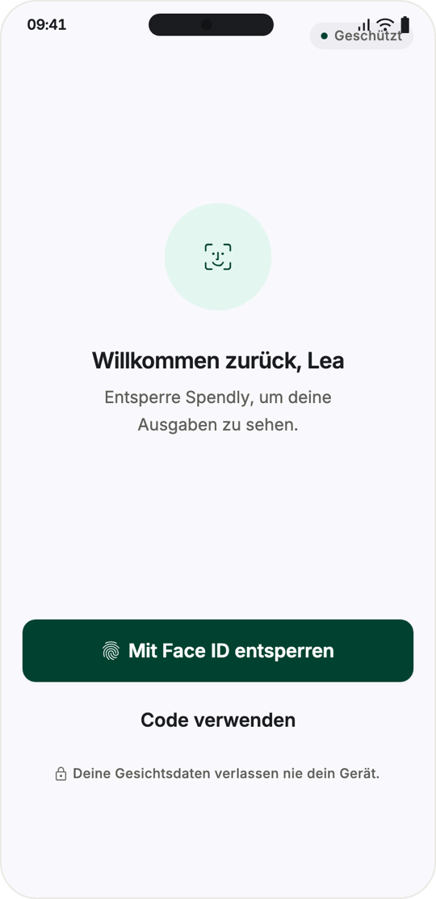
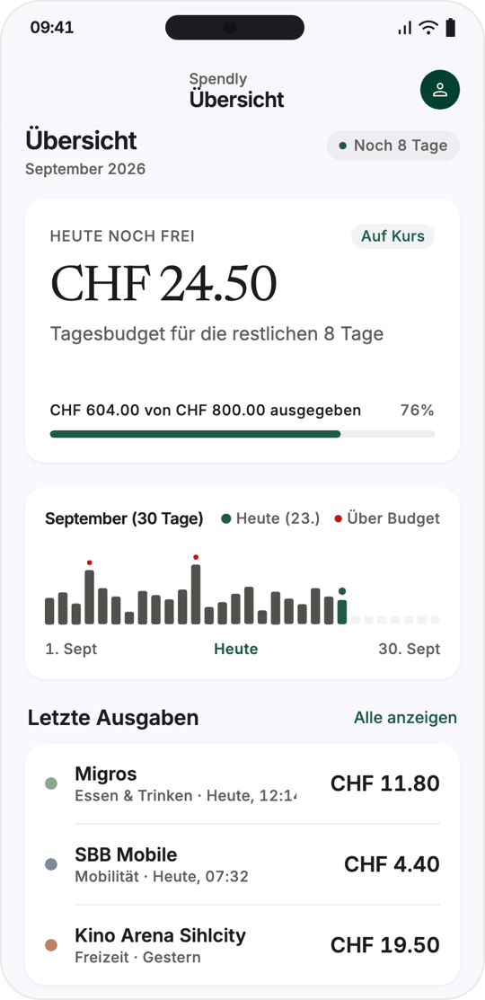
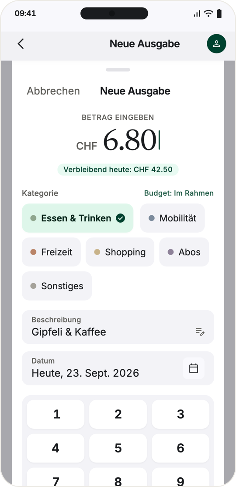
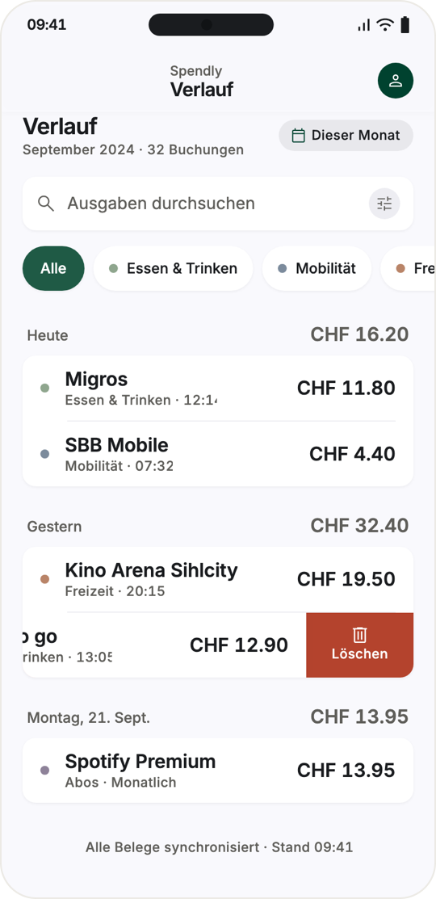
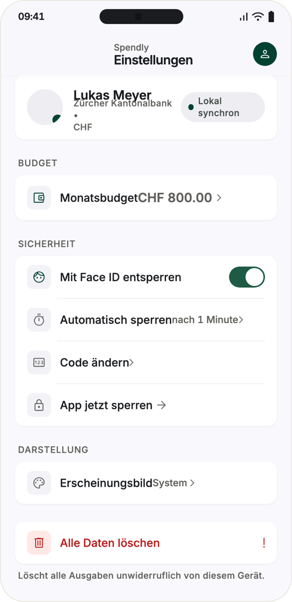
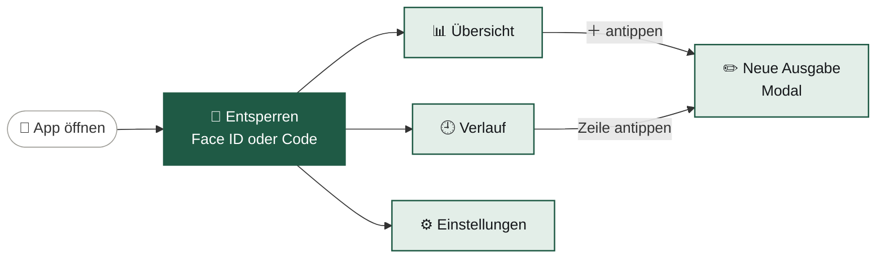
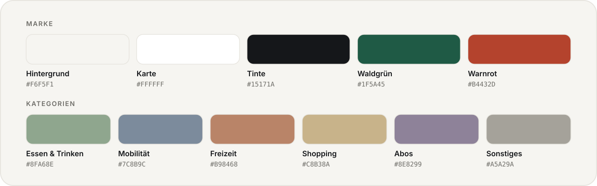

<a id="top"></a>

<picture>
  <source media="(prefers-color-scheme: dark)" srcset="docs/readme/banner-dark.svg">
  
</picture>

<p align="center">
  
  
  
  
  
</p>

<p align="center">
  <b>Ausgaben in Sekunden erfassen – und jederzeit wissen, wie viel heute noch drinliegt.</b><br>
  <sub>Eine React-Native-App für iOS und Android · entwickelt im Modul 335 «Mobile-Applikation realisieren»</sub>
</p>

<p align="center">
  <a href="#-schnellstart"><b>Schnellstart</b></a>&nbsp;&nbsp;·&nbsp;&nbsp;<a href="#a--ohne-face-id-mit-expo-go">Ohne Face ID</a>&nbsp;&nbsp;·&nbsp;&nbsp;<a href="#b--mit-face-id-als-eigene-app">Mit Face ID</a>&nbsp;&nbsp;·&nbsp;&nbsp;<a href="#-funktionen">Funktionen</a>&nbsp;&nbsp;·&nbsp;&nbsp;<a href="#-technik">Technik</a>&nbsp;&nbsp;·&nbsp;&nbsp;<a href="#-hilfe-bei-problemen">Hilfe</a>
</p>

<br>

<p align="center">
  &nbsp;&nbsp;&nbsp;&nbsp;
</p>
<p align="center">
  <sub>Entsperren&nbsp;&nbsp;·&nbsp;&nbsp;Übersicht&nbsp;&nbsp;·&nbsp;&nbsp;Neue Ausgabe&nbsp;&nbsp;·&nbsp;&nbsp;Verlauf&nbsp;&nbsp;·&nbsp;&nbsp;Einstellungen</sub>
</p>

<br>

## ✨ Auf einen Blick

<table>
  <tr>
    <td width="33%" valign="top">
      <h3>🔐 Geschützt</h3>
      Face ID oder ein eigener 6-stelliger Code. Nach einer Minute im Hintergrund sperrt sich Spendly von selbst wieder.
    </td>
    <td width="33%" valign="top">
      <h3>💸 Tagesbudget</h3>
      «Heute noch frei» verteilt dein Monatsbudget auf die restlichen Tage. So siehst du sofort, ob der Kaffee noch drinliegt.
    </td>
    <td width="33%" valign="top">
      <h3>📴 Ganz privat</h3>
      Kein Konto, kein Server, kein Internet nötig. Alle Daten bleiben in einer SQLite-Datenbank auf deinem Handy.
    </td>
  </tr>
</table>

<br>

## 🚀 Schnellstart

Es gibt **zwei Wege**, Spendly zu starten. Beide verwenden denselben Code – der Unterschied ist nur, *wie* die App auf dein Handy kommt.

| | 🅰️&nbsp; **Ohne Face ID** | 🅱️&nbsp; **Mit Face ID** |
| :-- | :-- | :-- |
| **So läuft die App** | in der Gratis-App **Expo Go** | als **eigene App** direkt auf dem iPhone |
| **Entsperren mit** | 6-stelligem Code<br><sub>(Android: auch Fingerabdruck)</sub> | **Face ID** und Code |
| **Du brauchst** | Computer mit Node.js<br>Handy mit Expo Go | zusätzlich: **Mac mit Xcode**,<br>Apple-ID (gratis) und USB-Kabel |
| **Dauer beim ersten Mal** | ⏱️ ca. 5 Minuten | ⏱️ ca. 20 Minuten |
| **Ideal für** | schnell ausprobieren, Android | Präsentation, Face ID testen |
| | **[→ Zur Anleitung A](#a--ohne-face-id-mit-expo-go)** | **[→ Zur Anleitung B](#b--mit-face-id-als-eigene-app)** |

> [!NOTE]
> **Warum zwei Wege?** Expo Go kann auf dem iPhone kein Face ID verwenden – das ist eine Einschränkung von Expo Go, nicht von Spendly.
> Die App erkennt das und bietet in Expo Go direkt die Code-Eingabe an. Für Face ID wird Spendly deshalb als eigene App gebaut (ein sogenannter *Development Build*).

<br>

---

### A · Ohne Face ID (mit Expo Go)

> Der schnellste Weg. Funktioniert auf **iPhone und Android** – auf Android sogar mit Fingerabdruck.

####  &nbsp;Projekt holen

Du brauchst [Node.js](https://nodejs.org) (LTS-Version) und [Git](https://git-scm.com). Dann im Terminal:

```bash
git clone https://github.com/germanndarian/Spendly.git
```

```bash
cd Spendly
```

```bash
npm install
```

####  &nbsp;Expo Go aufs Handy laden

<p>
  <a href="https://apps.apple.com/app/expo-go/id982107779"></a>
  &nbsp;
  <a href="https://play.google.com/store/apps/details?id=host.exp.exponent"></a>
</p>

####  &nbsp;Entwicklungs-Server starten

```bash
npx expo start
```

Im Terminal erscheint ein grosser QR-Code. Lass das Terminal-Fenster offen – solange es läuft, ist die App mit deinem Computer verbunden.

####  &nbsp;QR-Code scannen

| 📱 iPhone | 🤖 Android |
| :-- | :-- |
| Mit der normalen **Kamera-App** scannen und auf «In Expo Go öffnen» tippen. | In **Expo Go** auf «Scan QR code» tippen. |

> [!IMPORTANT]
> Computer und Handy müssen im **selben WLAN** sein. Klappt das nicht (z. B. im Schulnetz), startest du den Server mit `npx expo start --tunnel`.

####  &nbsp;Code festlegen – fertig! 🎉

Beim ersten Start wählst du einen **6-stelligen Code** und gibst ihn zur Bestätigung ein zweites Mal ein. Danach landest du in der Übersicht.

Auf dem iPhone zeigt Spendly den Hinweis *«Face ID ist in Expo Go nicht erlaubt. Entsperre Spendly mit deinem Code.»* – das ist so gewollt. Willst du Face ID sehen, geht es mit **Weg B** weiter.

> [!TIP]
> Drückst du im Terminal <kbd>r</kbd>, lädt die App neu. Mit <kbd>i</kbd> öffnet sie sich im iPhone-Simulator, mit <kbd>a</kbd> im Android-Emulator (falls installiert).

<p align="right"><sub><a href="#top">↑ nach oben</a></sub></p>

---

### B · Mit Face ID (als eigene App)

> Spendly wird mit Xcode gebaut und direkt auf dein iPhone installiert. Du brauchst dafür einen **Mac** – eine **kostenlose Apple-ID** reicht.

**Checkliste – das brauchst du:**

- [ ] einen Mac mit **Xcode** (gratis im Mac App Store)
- [ ] **Node.js** (LTS) und **Git**
- [ ] ein **iPhone mit Face ID** und ein USB-Kabel
- [ ] eine **Apple-ID** (kein bezahltes Entwicklerkonto nötig)

####  &nbsp;Projekt holen

Genau wie bei Weg A:

```bash
git clone https://github.com/germanndarian/Spendly.git
```

```bash
cd Spendly
```

```bash
npm install
```

####  &nbsp;Xcode einrichten

1. **Xcode** aus dem [Mac App Store](https://apps.apple.com/app/xcode/id497799835) installieren und **einmal öffnen**. Xcode lädt dann noch Zusatzkomponenten (iOS-Plattform) – einfach bestätigen.
2. In Xcode **Settings → Accounts** öffnen, unten auf **+** klicken und mit deiner **Apple-ID** anmelden.
   Daraus entsteht dein persönliches Entwicklerteam, mit dem die App signiert wird.

####  &nbsp;CocoaPods installieren

CocoaPods lädt die iOS-Bausteine der App. Am einfachsten mit [Homebrew](https://brew.sh):

```bash
brew install cocoapods
```

Prüfen, ob es geklappt hat – es sollte eine Versionsnummer erscheinen:

```bash
pod --version
```

####  &nbsp;iPhone vorbereiten

1. iPhone **entsperren** und per **USB-Kabel** mit dem Mac verbinden.
2. Auf die Frage *«Diesem Computer vertrauen?»* mit **Vertrauen** antworten.
3. **Entwicklermodus** einschalten: *Einstellungen → Datenschutz & Sicherheit → Entwicklermodus*.
   Das iPhone startet neu und fragt danach noch einmal nach – mit **Einschalten** bestätigen.

> [!NOTE]
> Der Punkt «Entwicklermodus» erscheint erst, nachdem das iPhone einmal mit Xcode verbunden war. Fehlt er, zuerst Schritt 5 starten – danach taucht er auf.

####  &nbsp;App bauen und installieren

```bash
npx expo run:ios --device
```

Wähle in der Liste dein iPhone aus. Der **erste Build dauert 5–10 Minuten** – danach geht es viel schneller. Dabei passiert automatisch:

- Expo erzeugt den Ordner `ios/` (das Xcode-Projekt; er wird nicht ins Repo eingecheckt).
- CocoaPods installiert die iOS-Bausteine.
- Xcode baut die App, signiert sie mit deiner Apple-ID und installiert sie auf dem iPhone.
- Der Entwicklungs-Server startet und Spendly öffnet sich.

> [!IMPORTANT]
> **Bundle-ID:** Jede App braucht eine eindeutige Kennung, z. B. `com.deinname.spendly`. Fehlt sie in `app.json`, fragt Expo beim ersten Build danach.
> Meldet Xcode, die ID sei *«not available»*, ist sie schon von einer anderen Apple-ID belegt: In `app.json` unter `ios.bundleIdentifier` eine eigene eintragen und `npx expo prebuild --clean` ausführen.

####  &nbsp;Dem Entwickler vertrauen

Beim allerersten Mal blockiert iOS die App mit *«Nicht vertrauenswürdiger Entwickler»*. So gibst du sie frei:

*Einstellungen → Allgemein → VPN & Geräteverwaltung* → deine Apple-ID antippen → **Vertrauen**.

Danach die Spendly-App auf dem Homescreen öffnen.

####  &nbsp;Face ID ausprobieren 🎉

1. **Code festlegen** (6 Ziffern, zweimal eingeben) – der Code bleibt immer als Ersatz, falls Face ID nicht klappt.
2. In Spendly zu **Einstellungen** wechseln – der Schalter **Face ID** ist schon eingeschaltet.
3. Auf **«App jetzt sperren»** tippen.
4. Auf dem Sperrbildschirm **«Mit Face ID entsperren»** antippen.
5. iOS fragt einmalig, ob Spendly Face ID verwenden darf – mit **OK** bestätigen. Fertig! 🔓

####  &nbsp;Im Alltag weiterarbeiten

Die App ist jetzt fest auf deinem iPhone installiert. Für Änderungen am JavaScript-Code musst du **nicht neu bauen**:

```bash
npx expo start
```

Dann einfach **die Spendly-App auf dem iPhone öffnen** – nicht den QR-Code scannen (der würde Expo Go öffnen). Mac und iPhone müssen im selben WLAN sein.

Neu bauen (Schritt 5) musst du nur, wenn eine neue native Bibliothek dazukommt oder Expo aktualisiert wurde.

<br>

<details>
<summary><b>🎤 Für die Präsentation: Spendly ohne Mac starten (Release-Build)</b></summary>
<br>

Ein Release-Build packt den ganzen JavaScript-Code in die App. Sie läuft dann **ohne Entwicklungs-Server** und ohne WLAN-Verbindung zum Mac – wie eine richtige App aus dem App Store:

```bash
npx expo run:ios --device --configuration Release
```

> [!WARNING]
> Mit einer **kostenlosen** Apple-ID läuft eine selbst installierte App nur **7 Tage**. Danach startet sie nicht mehr – einfach den Befehl nochmals ausführen. Am besten am Tag vor der Präsentation neu bauen.

</details>

<details>
<summary><b>🖥️ Face ID ohne iPhone testen (iOS-Simulator)</b></summary>
<br>

Der Simulator braucht weder Kabel noch Apple-ID:

```bash
npx expo run:ios
```

Danach im Menü des Simulators **Features → Face ID → Enrolled** aktivieren.
Wenn Spendly nach Face ID fragt, wählst du **Features → Face ID → Matching Face** (erkannt) oder **Non-matching Face** (nicht erkannt) – so lassen sich auch die Fehlerfälle zeigen.

</details>

<p align="right"><sub><a href="#top">↑ nach oben</a></sub></p>

<br>

## 🧭 Erste Schritte in der App

| | Was | Wo |
| :-: | :-- | :-- |
| 💰 | **Monatsbudget festlegen** (Standard: CHF 800.00) | Einstellungen → Monatsbudget |
| ➕ | **Erste Ausgabe erfassen**: Betrag, Kategorie, fertig | grüner **+**-Knopf unten rechts |
| 🧪 | **Demo-Daten laden**: rund 40 typische Ausgaben (Migros, SBB, Kino …) | Einstellungen → ganz unten *(nur im Entwicklungsmodus)* |
| 🌙 | **Dunkles Design** | Einstellungen → Erscheinungsbild → Hell / Dunkel / System |
| ⏲️ | **Sperrzeit** wählen: Sofort, 1 Minute, 5 Minuten oder Nie | Einstellungen → Automatisch sperren |

<br>

## 📱 Funktionen



<p align="center"><sub>Nach dem Entsperren sind die drei Tabs immer erreichbar. Mit «App jetzt sperren» oder nach der Sperrzeit im Hintergrund geht es zurück zum Entsperren.</sub></p>

| Screen | Was man dort macht |
| :-- | :-- |
| 🔐 **Entsperren** | Face ID bzw. Fingerabdruck, eigener 6-stelliger Code als Ersatz. Nach 3 Fehlversuchen geht es automatisch mit dem Code weiter. Beim ersten Start wird der Code festgelegt. |
| 📊 **Übersicht** | «Heute noch frei» (Tagesbudget), Fortschritt im Monat, Monatsstreifen mit einem Balken pro Tag (rot markiert: über dem Tagesbudget) und die letzten 3 Ausgaben. |
| ✏️ **Neue Ausgabe** | Betrag, Kategorie, Beschreibung und Datum – mit Prüfung in Echtzeit. Dasselbe Formular dient zum Bearbeiten und Löschen. |
| 🕘 **Verlauf** | Alle Ausgaben nach Tag gruppiert, mit Suche und Kategorie-Filter. Nach links wischen löscht, «Rückgängig» holt die Ausgabe 5 Sekunden lang zurück. |
| ⚙️ **Einstellungen** | Monatsbudget, Face ID an/aus, Sperrzeit, Code ändern, App sperren, Hell/Dunkel/System, alle Daten löschen. |

> [!TIP]
> **Special Feature:** Biometrie mit `expo-local-authentication`. Die App bekommt vom Gerät nur *«erkannt»* oder *«nicht erkannt»* zurück – Gesichts- und Fingerabdruckdaten sieht sie nie.

<br>

## 🧰 Technik

<table>
  <tr>
    <td><b>Grundlage</b></td>
    <td>Expo SDK 57 · React Native 0.86 · <b>JavaScript</b> (bewusst ohne TypeScript)</td>
  </tr>
  <tr>
    <td><b>Navigation</b></td>
    <td>React Navigation 7 – Root-Stack (Entsperren → Tabs → Modal) und Bottom-Tabs</td>
  </tr>
  <tr>
    <td><b>Daten</b></td>
    <td><code>expo-sqlite</code> für Ausgaben und Einstellungen · <code>expo-secure-store</code> für den Code-Hash</td>
  </tr>
  <tr>
    <td><b>Sicherheit</b></td>
    <td><code>expo-local-authentication</code> (Face ID / Fingerabdruck) · <code>expo-crypto</code> (SHA-256 mit Salz, UUIDs)</td>
  </tr>
  <tr>
    <td><b>Oberfläche</b></td>
    <td>nur Core-Komponenten und <code>StyleSheet.create</code> – keine UI-Bibliothek · Icons von Feather · Schriften Inter und Newsreader</td>
  </tr>
  <tr>
    <td><b>Extras</b></td>
    <td><code>expo-haptics</code> (Rückmeldung beim Speichern) · <code>@react-native-community/datetimepicker</code></td>
  </tr>
  <tr>
    <td><b>Tests</b></td>
    <td>jest-expo – 5 Testdateien, 65 Tests für alle Hilfsfunktionen in <code>utils/</code></td>
  </tr>
</table>

### Projektstruktur

```text
📦 Spendly
├── App.js              Schriften laden, Provider (Safe Area, Daten, Farben), Navigation
├── 🧭 navigation/      RootNavigator (Stack + automatische Sperre), MainTabs
├── 📱 screens/         LockScreen · OverviewScreen · NewExpenseScreen · HistoryScreen · SettingsScreen
├── 🧩 components/      kleine Bausteine: Button, Chip, ExpenseRow, MonthStrip, Snackbar …
├── 💾 storage/         ALLER Zugriff auf SQLite und SecureStore (db, expenses, settings, pin, DataContext)
├── 🧮 utils/           reine Funktionen: Format, Budget, Validierung, Listen (+ Unit-Tests)
├── 🎨 theme/           Farben (hell/dunkel), Schriften, Abstände, ThemeContext
├── 🧪 data/            Demo-Ausgaben für die Präsentation
└── 🖼️ design/          Mockups als PNG
```

Die Screens greifen **nie direkt** auf die Datenbank zu, sondern nur über `useData()` aus `storage/DataContext.js`. So bleibt jeder Screen kurz, und alle SQL-Befehle stehen an einem Ort.

### Datenhaltung

| Daten | Speicherort | Warum |
| :-- | :-- | :-- |
| Ausgaben | SQLite, Tabelle `expenses` (Index auf `date`) | Kern der App |
| Budget, Face ID an/aus, Sperrzeit, Erscheinungsbild, letzte Kategorie | SQLite, Tabelle `settings` | Man soll nicht bei jedem Start neu einstellen müssen |
| App-Code | `expo-secure-store` (`spendly_pin_hash`) | nur als gesalzener SHA-256-Hash, nie im Klartext |

- 🪙 **Beträge in Rappen:** Alle Beträge sind ganze Zahlen (CHF 12.50 = `1250`). So entstehen keine Rundungsfehler wie bei `0.1 + 0.2`.
- 🧮 **Summen in SQL:** Monatssumme und Tagessummen rechnet SQLite mit `SUM` und `GROUP BY` aus – nicht JavaScript.
- 🏷️ **Schema-Version** in `PRAGMA user_version`, damit spätere Änderungen bestehende Daten nicht zerstören.
- 🚫 **Bewusst nicht gespeichert:** Gesichts- und Fingerabdruckdaten (die sieht die App nie) und der Entsperrt-Status – nach einem Neustart ist Spendly immer gesperrt.

<br>

## 🎨 Gestaltung

<picture>
  <source media="(prefers-color-scheme: dark)" srcset="docs/readme/palette-dark.svg">
  
</picture>

Warmes Off-White, Tinte und ein dunkles **Waldgrün** als einzige Akzentfarbe. Rot erscheint nur bei Budgetüberschreitung, Fehlern und beim Löschen – und **immer zusammen mit Icon und Text**, nie als Farbe allein.

- **Schriften:** *Newsreader* (Serif) für grosse Beträge, *Inter* für alles andere – Beträge mit tabellarischen Ziffern im Schweizer Format `CHF 1'240.50`
- **Raster:** 8-Punkt-Raster, 20 pt Seitenrand, Radius 16 für Karten und 12 für Buttons, Haarlinien statt Schatten
- **Barrierefreiheit:** jedes tippbare Element mindestens 48 pt hoch, Screenreader-Beschriftungen für alle Icon-Buttons, Dark Mode

<br>

## 🧪 Tests und Prüfungen

| Befehl | Was er macht |
| :-- | :-- |
| `npm test` | Unit-Tests der Hilfsfunktionen in `utils/` |
| `npx expo lint` | prüft den Code-Stil (ESLint) |
| `npx expo-doctor` | prüft Abhängigkeiten und Konfiguration |

Die manuellen Testfälle und ihre Ergebnisse stehen im **[Testkonzept](TESTKONZEPT.md)**.

<br>

## 🆘 Hilfe bei Problemen

<details>
<summary><b>Rote Fehlermeldung «Cannot find native module 'ExpoAsset'»</b></summary>
<br>

Das ist ein bekannter Fehler von Expo: Der Entwicklungs-Server ist durcheinander, am Code liegt es nicht. So wird es wieder gut:

1. Im Terminal den Server mit <kbd>Ctrl</kbd> + <kbd>C</kbd> stoppen.
2. Mit leerem Cache neu starten:
   ```bash
   npx expo start --clear
   ```
3. Expo Go auf dem Handy ganz schliessen (in der App-Übersicht wegwischen) und den QR-Code nochmals scannen.

</details>

<details>
<summary><b>«Something went wrong running <code>pod install</code>»</b></summary>
<br>

Meistens passen nach einem Update die gespeicherten Versionen nicht mehr. Die Datei `ios/Podfile.lock` wird automatisch erzeugt und darf gelöscht werden:

```bash
rm ios/Podfile.lock
```

```bash
npx pod-install
```

Danach Schritt 5 nochmals ausführen.

</details>

<details>
<summary><b>«No code signing certificates are available to use»</b></summary>
<br>

Xcode kennt deine Apple-ID noch nicht. In Xcode unter **Settings → Accounts** mit der Apple-ID anmelden (Weg B, Schritt 2) und den Build nochmals starten.

</details>

<details>
<summary><b>Die App lässt sich nicht öffnen: «Entwicklermodus erforderlich» oder «Nicht vertrauenswürdiger Entwickler»</b></summary>
<br>

- **Entwicklermodus:** *Einstellungen → Datenschutz & Sicherheit → Entwicklermodus* einschalten (Weg B, Schritt 4).
- **Nicht vertrauenswürdig:** *Einstellungen → Allgemein → VPN & Geräteverwaltung* → Apple-ID → **Vertrauen** (Weg B, Schritt 6).

</details>

<details>
<summary><b>Spendly startete bisher, jetzt schliesst es sich sofort wieder</b></summary>
<br>

Mit einer kostenlosen Apple-ID läuft die App nur 7 Tage. Einfach neu bauen:

```bash
npx expo run:ios --device
```

</details>

<details>
<summary><b>Der Face-ID-Schalter ist ausgegraut</b></summary>
<br>

- **In Expo Go auf dem iPhone** ist das normal – dort geht Face ID nicht. Nimm Weg B.
- **In der eigenen App:** Face ID wurde für Spendly verboten. In den iPhone-*Einstellungen → Spendly* Face ID wieder erlauben.
- Ist auf dem iPhone gar kein Gesicht eingerichtet, zuerst unter *Einstellungen → Face ID & Code* Face ID einrichten.

</details>

<details>
<summary><b>Code vergessen?</b></summary>
<br>

Den Code kann niemand wiederherstellen – er ist nur als Hash gespeichert. Auf dem Sperrbildschirm führt **«Code vergessen?»** zum Löschen aller Daten, danach legst du einen neuen Code fest.

</details>

<details>
<summary><b>«Port 8081 is being used by another process»</b></summary>
<br>

Es läuft schon ein Entwicklungs-Server, meistens in einem anderen Terminal-Fenster. Dort mit <kbd>Ctrl</kbd> + <kbd>C</kbd> stoppen – oder die Frage von Expo, einen anderen Port zu verwenden, mit <kbd>Y</kbd> bestätigen.

</details>

<br>

---

<p align="center">
  <sub>Entwickelt im <b>Modul 335 «Mobile-Applikation realisieren»</b> von zwei ICT-Lernenden · 2026</sub><br>
  <sub>🌿 Alle Daten bleiben auf deinem Gerät.</sub>
</p>

<p align="center"><sub><a href="#top">↑ nach oben</a></sub></p>
